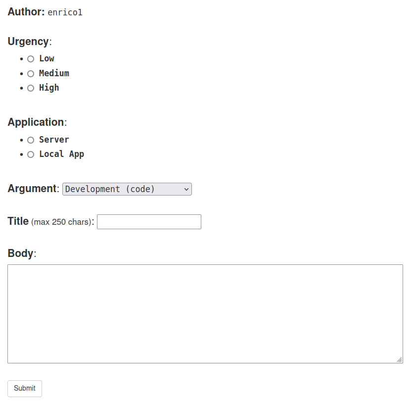
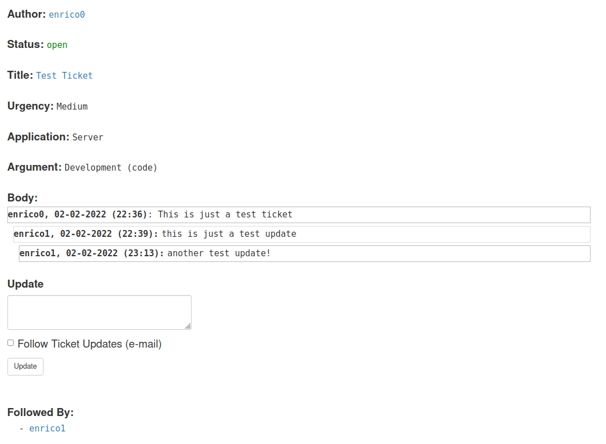
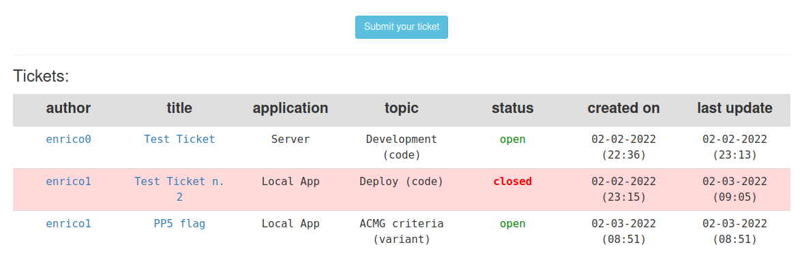
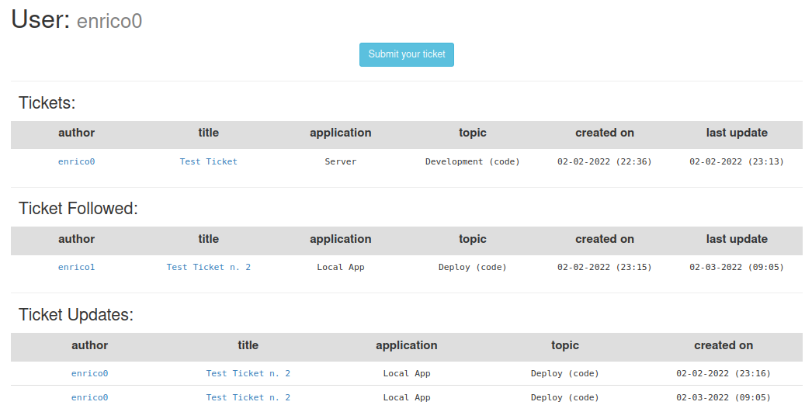

# Flasket

Flask(tick)et: a Ticket service for your [Flask](https://flask.palletsprojects.com/en/2.0.x/) application!

---
## Advantages

The way we developed [Flasket](https://github.com/cccnrc/flasket) has several advantages:
1. you use tickets within ***your application***:
   - ***only registered users*** will be able to submit and interact with tickets, avoiding bots, spam, etc.
   - ***your website*** will serve the ticketing system as its own service, you are not redirected to a different website etc.
   - ***e-mail updates*** are sent to users for every ticket important activity, and these mails will come from your website, not external servers etc.
2. you can ***edit tickets*** as you wish to best reflect your application needs
3. it creates a ***domain subdirectory***: all web pages related to tickets will start their URL with: `https://yourdomain.com/ticket/` making it extremely easier to organize (for developers) and to use (for users)
4. its extremely easy to integrate and update as it lives in a ***dedicated folder*** ([ticket](https://github.com/cccnrc/flasket/blob/main/ticket)) within your application: you only need to work on this folder
5. you can ***develop*** whatever improvement to [Flasket](https://github.com/cccnrc/flasket) and we'll consider integration (see [Development](https://github.com/cccnrc/flasket#development) section above)
6. ***extremely user friendly*** pages:

Ticket submission page:


Ticket page:


Tickets page:


User ticket page:


We used [Blueprint](https://flask.palletsprojects.com/en/2.0.x/blueprints/) to develop this: you only need to copy [ticket](https://github.com/cccnrc/flasket/blob/main/ticket) folder in you application and setup the database and a couple of `import` and you will have your ticketing system on!

---
## Installation

In order to implement [Flasket](https://github.com/cccnrc/flasket) in your application you need to take 4 simple steps:
1. clone [Flasket](https://github.com/cccnrc/flasket)
2. copy [Flasket](https://github.com/cccnrc/flasket) folders in your Flask application
3. setup [Flasket](https://github.com/cccnrc/flasket) imports in your Flask application
4. edit [Flasket](https://github.com/cccnrc/flasket) [forms.py](https://github.com/cccnrc/flasket/blob/main/ticket/forms.py) to reflect your application
5. edit [Flasket](https://github.com/cccnrc/flasket) HTML pages to reflect your application
6. create [Flasket](https://github.com/cccnrc/flasket) tables in your application database
7. use [Flasket](https://github.com/cccnrc/flasket) :sunglasses:

<br/>

### 1. clone [Flasket](https://github.com/cccnrc/flasket)
**1.1.** set your application main folder as `APP_DIR` environment variable:
```
APP_DIR=<your-Flask-application-directory>
```
- ***note***: replace `<your-Flask-application-directory>` with the path to your Flask application directory

<br />

**1.2.** clone the [Flasket](https://github.com/cccnrc/flasket) repository (outside your application folder):
```
cd
git clone https://github.com/cccnrc/flasket.git
FLASKET_DIR=$( pwd )/flasket
```
- **Important**: if you use different terminal windows environment variables ***are not inherited***. Thus, you need to ***reset*** them (`APP_DIR`, `FLASKET_DIR`) for any new terminal window you will use.


<br/>
<br/>

### 2. copy [Flasket](https://github.com/cccnrc/flasket) folders in your Flask application
**2.1.** we want to create a `ticket` blueprint branch for our application. We first need to create the folder in your application structure: you can simply copy into `app/` the [ticket](https://github.com/cccnrc/flasket/blob/main/ticket) folder of this repository:
```
cp -r $FLASKET_DIR/ticket $APP_DIR/app/
```
Assuming your application main folder is called `app` you should get this structure:
```
$APP_DIR
├── app
│   ├── ticket
│   │   ├── __init__.py
│   │   ├── email.py
│   │   ├── forms.py
│   │   └── routes.py
│   └── ...rest of app files...
```

**2.2.** you can now put [flasket templates](https://github.com/cccnrc/flasket/blob/main/templates/ticket) inside your `app/templates` folder.
This way you will have all templates related to this service inside that folder:
```
cp -r $FLASKET_DIR/templates/ticket $APP_DIR/app/templates/
```
Your application should look similar to this now:
```
$APP_DIR
├── app
│   ├── ticket
│   │   ├── __init__.py
│   │   ├── email.py
│   │   ├── forms.py
│   │   └── routes.py
│   ├── templates
│   │   ├── ... rest of your templates ...
│   │   └── ticket
│   │       ├── index.html
│   │       ├── all.html
│   │       ├── ticket.html
│   │       ├── ticket_reply.html
│   │       ├── ticket_submit.html
│   │       └── user.html
```

<br/>
<br/>

### 3. setup [Flasket](https://github.com/cccnrc/flasket) imports in your Flask application
**3.1.** if you take a look at [\_\_init\_\_.py](https://github.com/cccnrc/flasket/blob/main/ticket/__init__.py) you see that this file simply defines a ticket `bp` (Blueprint) and imports all endpoints specified in its `routes.py` file:
```
from flask import Blueprint

bp = Blueprint('ticket', __name__)

from app.ticket import routes
```

**3.2.** import `ticket_bp` in your main application `app/__init__.py` file:
```
from app.ticket import bp as ticket_bp
app.register_blueprint( ticket_bp, url_prefix='/ticket' )
```
- **Important**: this step depends on how you are ***starting*** your Flask application. As example, we use a `create_app(config_class=Config)` function specified in `app/__init__.py` that we import into `main.py` and starts it whenever the application is launched:
```
from app import create_app, db

app = create_app()
```
- so we store the `app.ticket import` into that function in `app/__init__.py`:
```
from flask import Flask
from config import Config     ### variables store in app/config.py
# ... rest of imports ... #

def create_app(config_class=Config):

    app = Flask(__name__)
    app.config.from_object(config_class)

    # ... rest of function code ... #

    from app.ticket import bp as ticket_bp
    app.register_blueprint( ticket_bp, url_prefix='/ticket' )

    # ... rest of function code ... #

```
- this configuration will put into your URL `/ticket` before any of the endpoint inherited from `app/ticket/routes.py` and your website will look much more professional :sunglasses:


<br/>
<br/>

### 4. edit [Flasket](https://github.com/cccnrc/flasket) [forms.py](https://github.com/cccnrc/flasket/blob/main/ticket/forms.py) to reflect your application
[Flasket](https://github.com/cccnrc/flasket) tickets come with several fields that you find in [forms.py](https://github.com/cccnrc/flasket/blob/main/ticket/forms.py):
- *urgency*: the level of importance of the ticket (`urgency_choices`)
- *application*: which application the ticket is referring to (`ticket_app`)
- *argument*: which topic the ticket is referring to (`ticket_arg`)

You can edit those as you wish, add/remove categories etc. to reflect your application needs

<br/>
<br/>

### 5. edit [Flasket](https://github.com/cccnrc/flasket) HTML pages to reflect your application
[Flasket](https://github.com/cccnrc/flasket) has all HTML pages needed for your ticketing system already developed and available in `ticket/templates`.
We use [Django](https://docs.djangoproject.com/en/4.0/topics/templates/) to easily setup our HTML page, we assume you have a "base template" (as example, with the logos, navigation bar set etc.) of your application that we extends to all other templates with the first line of code you will find in any of them:
```

```
This assumes that this base template is called `base.html` and is found in `app/templates/`. Feel free to **change** this as you wish to reflect your application structure or **delete** it if you have no base template to extend!

<br/>
<br/>

### 6. create [Flasket](https://github.com/cccnrc/flasket) tables in your application database
**6.1.** modify your `models.py` accordingly to what is specified in [ticket-models-instructions.txt](https://github.com/cccnrc/flasket/blob/main/ticket-models-instructions.txt): you basically have to create `Ticket`, `TicketReply`, and `user_tickets` Tables, and add `admin`, `tickets`, `ticket_replies`, and `tickets_followed` to your `User` Table
You will find detailed instructions for this in [ticket-models-instructions.txt](https://github.com/cccnrc/flasket/blob/main/ticket-models-instructions.txt)

**6.2.** once `models.py` is updated, you need to apply those changes to your application database. Ex. if using `flask db`:
```
flask db migrate -m "added ticket tables"
flask db upgrade
```
or whatever method you are using for your Falsk application database management

- ***note***: if you add/remove columns etc. in [forms.py](https://github.com/cccnrc/flasket/blob/main/ticket/forms.py) you have to reflect such changes into `models.py`

<br/>
<br/>

### 7. use [Flasket](https://github.com/cccnrc/flasket) for your tickets! :sunglasses:
You should be able to launch your application and use your brand new ticketing system! Navigate to `<your-application-URL>/ticket/index` and start your journey! :wink:

Don't forget to put a link to tickets in your application navigation bar, homepage, etc. to let all users easily identify it!

---
## Updates
Anytime we make a changes to [Flasket](https://github.com/cccnrc/flasket) you can integrate such change into your running application simply updating `ticket` folders:
```
cd $FLASKET_DIR
git pull
cp -r $FLASKET_DIR/ticket $APP_DIR/app/
cp -r $FLASKET_DIR/templates/ticket $APP_DIR/app/templates/
```
- ***note***: you need to have `$APP_DIR` and `$FLASKET_DIR` set in your environment variables
- ***note***: if you make local changes to those files this update can erase your changes. We strongly recommend you to make changes to ***other files*** within those directories and `import` them into your main application to integrate with [Flasket](https://github.com/cccnrc/flasket) updates

---
## Development

Whenever you want to share a change you made to [Flasket](https://github.com/cccnrc/flasket):
```
cd $FLASKET_DIR
git branch <your-name>-development
git checkout <your-name>-development
git add .
git commit -m "<your-name>-development ..."
git push https://github.com/cccnrc/flasket.git <your-name>-development
```
- ***note***: change `<your-name>` in the above commands with your [GitHub](https://github.com/) username or whatever identifier you wish to have

---
## Acknowledgments

Regarding [Blueprint](https://flask.palletsprojects.com/en/2.0.x/blueprints/), mails, etc. you also have a guide in the outstanding Miguel Grinber [Microblog Tutorial](https://blog.miguelgrinberg.com/post/the-flask-mega-tutorial-part-xv-a-better-application-structure)

The way we set up the main application is based on the way [Microblog](https://blog.miguelgrinberg.com/post/the-flask-mega-tutorial-part-i-hello-world) is configured. If you take a look at this amazing tutorial, integrating [Flasket](https://github.com/cccnrc/flasket) will be extremely straightforward

Thank you so much Miguel, nothing of this would probably exists without your guide :pray:
